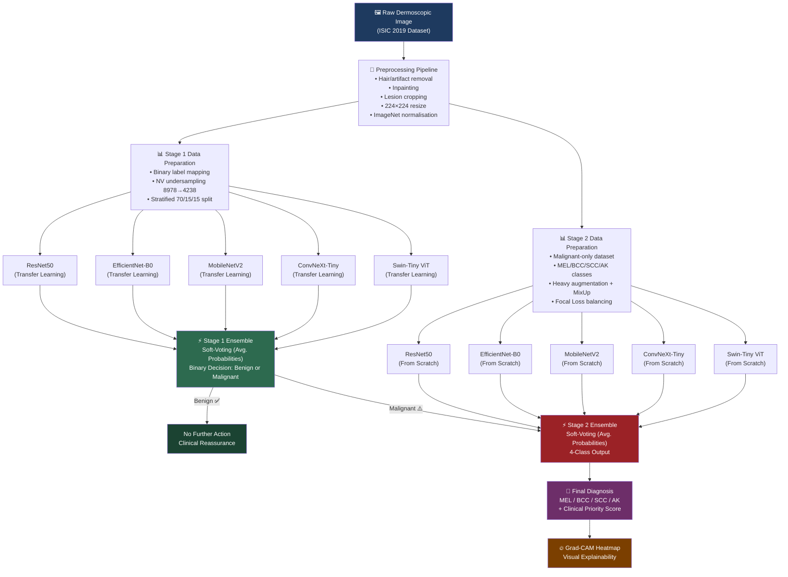
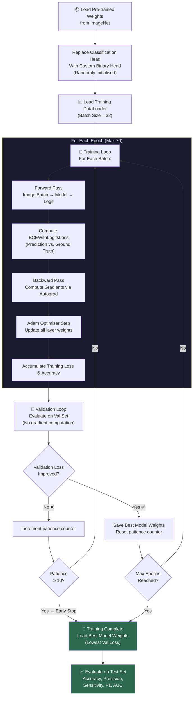
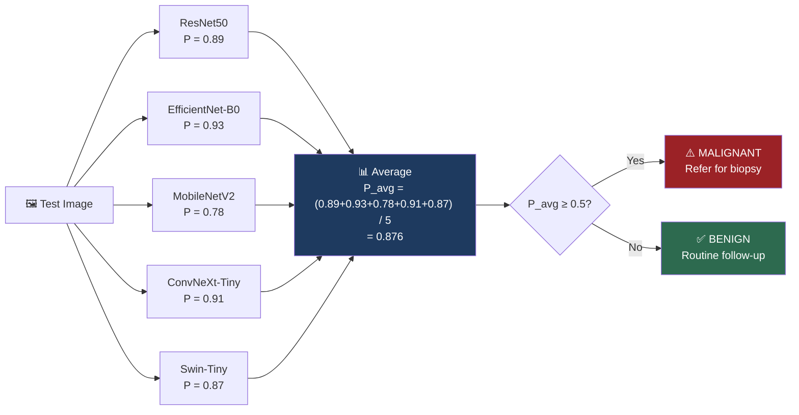
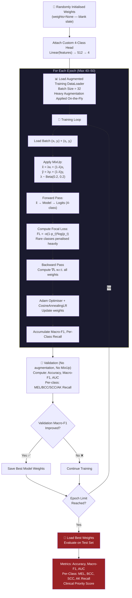
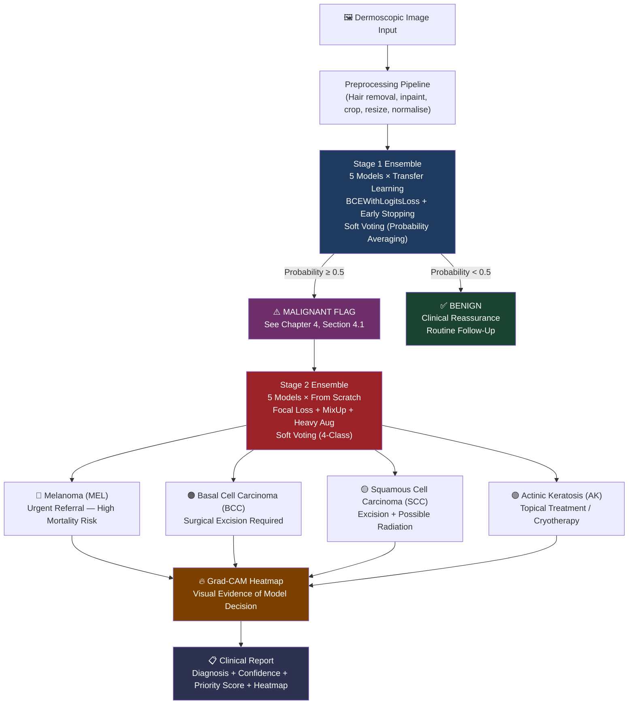

# Chapter 3: Methodology

**Project:** Automated Skin Cancer Detection and Classification Using Deep Learning  
**Authors:** Zohrouf Khattak (Roll No: 1000) · Huma Zeb (Roll No: 883)  
**Supervisor:** Dr. Muhammad Ayaz  
**Institution:** University of Peshawar, Shaikh Zayed Islamic Centre  
**Programme:** BSc Computer Science (Session 2022–2026)

---

## 3.1 Overview of the Proposed System

This research proposes a **Dual-Stage Ensemble Deep Learning Pipeline** for the automated detection and fine-grained classification of skin cancer from dermoscopic images. The system is designed to replicate key aspects of dermatologist diagnostic workflow: first confirming whether a lesion is dangerous (malignant or benign), and then — if malignant — identifying which specific type of cancer it is, so that appropriate clinical action can be taken.

The architecture is deliberately hierarchical and clinically motivated:

- **Stage 1** acts as a *triage gate*, filtering the vast majority of benign cases and flagging only those that require further investigation.
- **Stage 2** acts as a *specialist classifier*, identifying the exact malignant subtype from four clinically critical categories: Melanoma (MEL), Basal Cell Carcinoma (BCC), Squamous Cell Carcinoma (SCC), and Actinic Keratosis (AK).

Every design decision — from model selection to loss function choice to data handling — was driven by one overarching clinical requirement: **minimising false negatives**, since a missed cancer diagnosis is far more harmful than an unnecessary referral.

---

## 3.2 System Architecture Overview

The figure below illustrates the complete end-to-end pipeline from raw dermoscopic image input to final clinical-priority diagnosis output.



*Figure 3.1: Complete End-to-End System Architecture.*

---

## 3.3 Dataset: ISIC 2019 Challenge

### 3.3.1 Dataset Description

The **International Skin Imaging Collaboration (ISIC) 2019 Challenge** dataset was selected as the primary data source for this research. It is the largest publicly available benchmark for dermoscopic skin lesion classification and is widely accepted as the gold standard in computational dermatology research.

| Property | Detail |
|---|---|
| **Total Training Images** | 25,331 dermoscopic images |
| **Test Images** | 8,238 dermoscopic images |
| **Image Format** | JPEG (variable resolution; 600×450 pixels typical) |
| **Annotation Type** | Diagnosis-level labels (no pixel segmentation) |
| **Source** | International Skin Imaging Collaboration |
| **Access** | Publicly available via Kaggle |
| **Hardware Used** | Kaggle environment with NVIDIA Tesla T4 GPU |

### 3.3.2 The 8 Diagnostic Categories

The dataset contains images across 8 diagnostic categories. For this pipeline, these categories are mapped to a hierarchical label structure:

| ISIC Category | Full Name | Binary Label (Stage 1) | Multi-Class Label (Stage 2) |
|---|---|---|---|
| **MEL** | Melanoma | Malignant | Class 0 (MEL) |
| **NV** | Melanocytic Nevus | Benign | — |
| **BCC** | Basal Cell Carcinoma | Malignant | Class 1 (BCC) |
| **AK** | Actinic Keratosis | Malignant | Class 3 (AK) |
| **BKL** | Benign Keratosis-like Lesions | Benign | — |
| **DF** | Dermatofibroma | Benign | — |
| **VASC** | Vascular Lesions | Benign | — |
| **SCC** | Squamous Cell Carcinoma | Malignant | Class 2 (SCC) |

> [!NOTE]
> Stage 2 is trained **exclusively** on the four malignant classes (MEL, BCC, SCC, AK), which represent the clinically most important and most dangerous lesion types. Benign classes are filtered out before Stage 2 training begins.

> [!NOTE]
> **AK Classification Rationale:** Actinic Keratosis is clinically a pre-malignant lesion, not an established cancer. However, it is classified as **Malignant** for Stage 1 because progression to Squamous Cell Carcinoma (SCC) occurs in approximately 10–15% of untreated cases. Clinically, AK lesions require active intervention (topical treatment or cryotherapy), making early detection a priority.

### 3.3.3 Class Imbalance — The Critical Challenge

A severe class imbalance exists in the ISIC 2019 dataset, which is a fundamental challenge that must be addressed at both stages:

**Stage 1 Imbalance (Binary):**


The Melanocytic Nevus (NV) class contained 8,978 images — more than all malignant classes combined — creating a 3:1 benign-to-malignant imbalance that would cause naive models to default to predicting "Benign" on everything.

**Stage 2 Imbalance (Multi-Class Malignant):**

Within the malignant classes themselves, MEL dominates with ~4,522 images, while SCC has only ~628 images — a 7:1 within-class imbalance that makes detecting rare cancers extremely difficult.

---

## 3.4 Preprocessing Pipeline

Before any image is presented to a neural network, it undergoes a rigorous, multi-step preprocessing pipeline designed specifically for dermoscopic medical images. Each step addresses a specific artifact or standardisation requirement unique to skin lesion photography.

### 3.4.1 Preprocessing Flowchart

```mermaid
flowchart LR
    A["📷 Raw JPEG Image\n(Variable resolution)"] --> B

    subgraph PREPROC["Image Preprocessing Pipeline"]
        B["Step 1: Load & Decode\nPIL Image → RGB array"] --> C
        C["Step 2: Hair/Artifact Detection\nBlack-hat morphological filter\n+ Threshold binarisation\nDetects dark linear structures"] --> D
        D["Step 3: Inpainting\nOpenCV inpaint\n(Telea method)\nFills artifact regions with\nsurrounding skin texture"] --> E
        E["Step 4: Lesion Detection\nOtsu thresholding on grayscale\nFind largest contour →\nBounding box extraction"] --> F
        F["Step 5: Crop & Resize\nCrop to lesion bounding box\nResize → 224×224 pixels\n(bicubic interpolation)"] --> G
        G["Step 6: Tensor Conversion\nPIL → PyTorch Tensor\nPixel values: [0, 255] → [0.0, 1.0]"] --> H
        H["Step 7: Normalisation\nμ = [0.485, 0.456, 0.406]\nσ = [0.229, 0.224, 0.225]\n(ImageNet statistics)"]
    end

    H --> I["✅ Normalised 3×224×224 Tensor\nReady for model input"]

    style PREPROC fill:#1a1a2e,color:#e0e0ff
    style A fill:#2d3250,color:#fff
    style I fill:#2d6a4f,color:#fff
```



*Figure 3.2: Image Preprocessing Pipeline Flowchart.*

### 3.4.2 Step-by-Step Preprocessing Explanation

**Step 1 — Image Loading:**  
Each raw JPEG image is loaded from disk using the Python Imaging Library (PIL) and converted to RGB format, ensuring a consistent 3-channel input regardless of the original encoding.

**Step 2 — Hair and Artifact Detection:**  
Dermoscopic images routinely contain body hair, ruler marks, gel bubbles, and ink markings that can mislead a neural network. A **black-hat morphological transform** is applied using a **15×15 rectangular structuring element** (`cv2.MORPH_RECT`, kernel size 15×15). This operation effectively highlights dark, elongated structures (hairs) against the brighter skin background. A binary threshold is then applied to create an artifact mask.

**Step 3 — Inpainting (Artifact Removal):**  
The detected artifact mask is fed into OpenCV's `inpaint()` function using the **Telea fast marching algorithm** (Telea, 2004). This algorithm intelligently fills each artifact pixel by propagating information from the surrounding clean skin texture, producing a visually seamless reconstruction. The result is a "clean" image showing only the lesion itself.

**Step 4 — Lesion Detection:**  
The cleaned image is converted to grayscale, and **Otsu's global thresholding** is applied to separate the darker lesion region from the lighter surrounding skin. The largest contiguous contour is identified as the lesion boundary, and an axis-aligned bounding box is computed.

**Step 5 — Crop and Resize:**  
The image is cropped to the computed bounding box, eliminating extraneous background skin. The cropped patch is then resized to exactly **224×224 pixels** using bicubic interpolation. This resolution is the standard input size for all five model architectures used in this study.

**Step 6 — Tensor Conversion:**  
The 224×224 PIL image is converted into a PyTorch tensor with shape `(3, 224, 224)`, where the three dimensions represent the R, G, and B colour channels. Pixel values are automatically scaled from the integer range `[0, 255]` to the floating-point range `[0.0, 1.0]`.

**Step 7 — Normalisation:**  
The tensor is normalised using the standard **ImageNet statistics**: mean `μ = [0.485, 0.456, 0.406]` and standard deviation `σ = [0.229, 0.224, 0.225]` per channel. This is essential because all five model architectures were either pre-trained on ImageNet (Stage 1) or are architecturally designed around this normalisation range. Without this step, the model's pre-trained feature detectors would operate outside their calibrated input distribution.


---

## 3.5 Stage 1: Binary Classification (Benign vs. Malignant)

Stage 1 forms the clinical triage layer of the pipeline. Its sole objective is to determine, with the highest possible sensitivity, whether a dermoscopic image contains a malignant lesion that requires urgent clinical attention. **Every malignant lesion that Stage 1 misclassifies as benign is a missed diagnosis — a life-threatening error.** The entire design of Stage 1 is therefore optimised to maximise sensitivity (recall for the malignant class).

### 3.5.1 Stage 1 Data Preparation

#### Binary Label Mapping

The 8 ISIC categories are merged into two binary labels:

```
Malignant (Label = 1): MEL, BCC, AK, SCC
Benign    (Label = 0): NV, BKL, DF, VASC
```

#### Targeted NV Undersampling

The Melanocytic Nevus (NV) class, with 8,978 images, overwhelmingly dominated the benign class. Without intervention, any model trained on this raw distribution would learn to simply predict "Benign" for all inputs and achieve a deceptively high accuracy while completely failing at cancer detection.

The strategy employed was **targeted undersampling of the NV class only**:

- **Original NV count:** 8,978 images
- **After undersampling:** 4,238 images (a 52.8% reduction)
- **All other classes:** Unchanged (no data was discarded from DF, VASC, or BKL despite their smaller sample sizes, preserving all available benign variation)

This targeted approach was deliberately chosen over alternative techniques (e.g., random undersampling of all benign classes) because it preserves all available data from the already-smaller benign minority classes (DF, VASC, BKL), ensuring the model still learns their features.


#### Stratified Data Split

The balanced dataset was divided into three non-overlapping subsets using **stratified random sampling**, ensuring that the Malignant/Benign proportion is preserved identically across all three splits:

| Split | Proportion | Purpose |
|---|---|---|
| **Training Set** | 70% | Model weight optimisation |
| **Validation Set** | 15% | Hyperparameter tuning and early stopping |
| **Test Set** | 15% | Final, held-out performance evaluation |


#### Validation Strategy and Split Rationale

A **single hold-out 70/15/15 split** was selected over K-fold cross-validation for the following reasons:

1. **Data leakage prevention via GroupShuffleSplit:** Dermoscopic images from the same patient lesion may appear visually similar. To prevent any lesion appearing across the train/validation/test boundary, `sklearn.model_selection.GroupShuffleSplit` was applied using the `lesion_id` field as the grouping variable. This ensures all images from the same lesion remain in the same split — a critical requirement that standard stratified K-fold does not guarantee.

2. **Computational constraints:** Training five heterogeneous models (including Swin-Tiny and ConvNeXt-Tiny) on a single Kaggle T4 GPU for 70 epochs each is computationally intensive. K-fold cross-validation (e.g., 5-fold) would require 5× the training time, which was not feasible within the available compute budget.

3. **Dataset size:** With 25,331 raw images available (yielding 12,822 active training images, 3,800 validation images, and 3,800 test images after training set NV undersampling), the dataset is sufficiently large that a single split provides a statistically representative evaluation — a recognised threshold at which single-split evaluation is considered acceptable in practice.

The exact split sizes achieved were:
- **Raw splits (before undersampling):** Train: 17,731 | Validation: 3,800 | Test: 3,800 images (total 25,331).
- **Active splits (after training set NV undersampling):** Train (balanced): 12,822 | Validation: 3,800 | Test: 3,800 images. Note that undersampling was applied only to the training split. Validation and test splits retain the original class distribution, including the full NV count. Hence the active training set size is 12,822, while validation and test remain 3,800 each.

### 3.5.2 Stage 1 Model Architectures

Stage 1 employs a **5-model heterogeneous ensemble**, combining models from three distinct architectural families: classical deep CNNs, modern CNNs, and Vision Transformers. This deliberate diversity ensures that the ensemble captures different types of discriminative features from dermoscopic images.

#### Architecture 1: ResNet50 (Deep Residual Network)

ResNet50 is a 50-layer Convolutional Neural Network introduced by He et al. (2016). Its defining innovation is the **residual skip connection**: instead of learning a mapping `H(x)`, each residual block learns the *residual* `F(x) = H(x) - x`, and the input `x` is added back after the transformation. This skip connection creates a direct gradient highway, solving the **vanishing gradient problem** that previously prevented training of very deep networks.

```
Architecture: Input → [Conv1 → BN → ReLU → MaxPool]
              → [4 × Residual Stage (3-3-6-3 blocks)]
              → [Global Average Pool]
              → [Custom FC Head: 2048 → 512 → 1]
Parameters:   ~25.6 million
```

For Stage 1, the ResNet50's final fully-connected layer (`fc`) is replaced with a custom binary classification head: `Linear(2048, 512) → ReLU → Dropout(0.3) → Linear(512, 1)`.


#### Architecture 2: EfficientNet-B0 (Compound-Scaled CNN)

EfficientNet-B0, introduced by Tan & Le (2019), is built on the principle of **compound scaling**: simultaneously scaling the network's depth, width, and input resolution using a fixed set of coefficients derived from a neural architecture search. The baseline B0 variant is already highly optimised for efficiency.

Its core building block is the **MBConv (Mobile Inverted Bottleneck Convolution)** with Squeeze-and-Excitation (SE) attention, which allows the network to selectively emphasise informative channels:

```
Architecture: Input → Stem Conv
              → 7 × MBConv Stages (with SE blocks)
              → Head Conv → Global Avg Pool
              → Custom FC Head: 1280 → 512 → 1
Parameters:   ~5.3 million (most parameter-efficient in ensemble)
```


#### Architecture 3: MobileNetV2 (Inverted Residuals)

MobileNetV2 (Sandler et al., 2018) is designed for deployment in resource-constrained environments. Its core innovation is the **inverted residual block**: it first *expands* the channel dimension with a pointwise convolution (expansion factor of 6), applies a depthwise separable convolution in the expanded space, and then *projects* back to a narrow channel dimension. This design places the skip connection between narrow layers, dramatically reducing computational cost.

```
Architecture: Input → Conv2d stem
              → 17 × Inverted Residual Blocks
              → Conv2d head → Global Avg Pool
              → Custom FC Head: 1280 → 512 → 1
Parameters:   ~3.4 million (lightest in ensemble)
```


#### Architecture 4: ConvNeXt-Tiny (Modern CNN)

ConvNeXt-Tiny (Liu et al., 2022) represents the state-of-the-art in pure convolutional design. It was created by "modernising" a standard ResNet by incorporating every design decision that makes Vision Transformers successful — all while maintaining a purely convolutional structure.

Key innovations include:
- **Large 7×7 depthwise convolutions** (versus ResNet's 3×3), capturing larger receptive fields similar to ViT's attention windows
- **Inverted bottleneck design** borrowed from MobileNetV2
- **Layer Normalisation** instead of Batch Normalisation
- **GELU activation** instead of ReLU
- **Fewer, wider stages** following ViT's architectural proportions

```
Architecture: Input → Patchify Stem (4×4 Conv, stride 4)
              → 4 × ConvNeXt Stages (depths: 3-3-9-3)
              → Layer Norm → Global Avg Pool
              → Custom FC Head: 768 → 512 → 1
Parameters:   ~28.6 million
```


#### Architecture 5: Swin-Tiny (Shifted Window Vision Transformer)

Swin-Tiny (Liu et al., 2021) is a hierarchical Vision Transformer that processes images in non-overlapping **local windows** rather than globally attending to all patches simultaneously. This "shifted window" approach makes self-attention computationally feasible for high-resolution images.

The key mechanisms are:
1. **Patch Partition:** The 224×224 image is divided into non-overlapping 4×4 patches, creating a 56×56 sequence of patch tokens.
2. **Window-based Self-Attention (W-MSA):** Multi-head self-attention is computed within local 7×7 windows (49 patches per window), reducing complexity from quadratic to linear in image size.
3. **Shifted Window Attention (SW-MSA):** In alternating layers, the window partitioning is shifted by (⌊M/2⌋, ⌊M/2⌋) pixels, creating cross-window connections and enabling information flow across the entire image.
4. **Patch Merging:** At each stage transition, adjacent 2×2 patches are merged, halving the spatial resolution and doubling the channel dimension — creating a hierarchical feature pyramid.

```
Architecture: Input → Patch Partition (4×4, stride 4) → Linear Embed
              → 4 × Swin-Transformer Stages (W-MSA + SW-MSA)
              → Layer Norm → Global Avg Pool
              → Custom FC Head: 768 → 512 → 1
Parameters:   ~28.3 million
```


The inclusion of Swin-Tiny was particularly motivated by the hypothesis that global self-attention mechanisms can capture subtle spatial relationships in skin lesions (e.g., irregular borders, asymmetric textures) that purely local convolutional filters might miss.

### 3.5.3 Stage 1 Training Configuration

| Hyperparameter | Value | Justification |
|---|---|---|
| **Optimiser** | Adam (β₁=0.9, β₂=0.999) | Adaptive learning rate; robust to sparse gradients |
| **Learning Rate** | 1×10⁻⁴ (initial) | Standard for fine-tuning pre-trained CNNs |
| **LR Scheduler** | ReduceLROnPlateau (patience=5) | Reduces LR by 0.5× when val loss plateaus |
| **Loss Function** | BCEWithLogitsLoss | Combines sigmoid activation and binary cross-entropy in a numerically stable single operation; no `pos_weight` class weighting was applied — class balance was achieved exclusively through NV undersampling |
| **Batch Size** | 32 | Balance between GPU memory and gradient estimate quality |
| **Max Epochs** | 70 | Upper bound; early stopping terminates before this |
| **Early Stopping** | Patience = 10 epochs | Prevents overfitting; monitors validation loss |
| **Weight Init** | ImageNet pre-trained | Transfer learning from ImageNet features |
| **Fine-tuning** | All layers unfrozen | Full fine-tuning for maximum adaptation |

#### Hyperparameter Justification

All hyperparameter values (learning rate 1×10⁻⁴, batch size 32, Adam β₁/β₂, early stopping patience) were selected based on established best-practice values from the transfer learning literature (He et al., 2016; Tan & Le, 2019) rather than automated search methods. Grid or random search was not performed due to the five-model training overhead; the selected values represent the consensus starting point for fine-tuning ImageNet pre-trained CNNs on domain-specific medical imaging tasks.

#### Transfer Learning Strategy

All five Stage 1 models are initialised with **ImageNet pre-trained weights** (`pretrained=True` or `weights=IMAGENET1K_V1`). This is a critical design decision: the models already possess rich, hierarchical feature detectors from training on 1.2 million diverse images — edge detectors, texture analyzers, shape recognisers — all in their lower layers. Fine-tuning on dermoscopic images allows these features to be *adapted* to the medical imaging domain rather than learned from scratch.

The custom classification head (replacing the original ImageNet 1000-class head) is the only part of the network that is randomly initialised at the start of training.

> [!NOTE]
> **Domain Shift Consideration:** Recent work (Raghu et al., 2019, "Transfusion: Understanding Transfer Learning for Medical Imaging") argues that ImageNet pre-training offers diminishing returns for specialised medical image domains due to feature distribution mismatch. Stage 1 nonetheless uses ImageNet initialisation because: (1) dermoscopic images share low-level feature statistics (edges, textures) with natural images, and (2) the binary benign/malignant distinction is coarse enough that general-purpose features suffice. Stage 2's from-scratch design explicitly addresses this limitation for the more discriminative subtype classification task. This limitation is discussed further in Chapter 5 (Future Work).

#### Early Stopping

Early stopping monitors the **validation loss** after each epoch. If no improvement is observed for 10 consecutive epochs, training is halted and the model weights from the best validation epoch are restored. This prevents the model from overfitting to the training set.

For example: **Swin-Tiny triggered early stopping at Epoch 30** (out of a maximum of 70), indicating it had already converged to its optimal solution well before the epoch limit.

### 3.5.4 Stage 1 Training Flowchart



*Figure 3.3: Stage 1 Training and Early Stopping Workflow.*

### 3.5.5 Stage 1 Ensemble Strategy

After all five models are individually trained and evaluated, their predictions are combined through **probability averaging (soft voting)**:

```
P_ensemble(x) = (1/5) × [P_ResNet50(x) + P_EfficientNet(x) + P_MobileNet(x) + P_ConvNeXt(x) + P_Swin(x)]

Final Prediction = 1 (Malignant)  if P_ensemble(x) ≥ 0.5
                 = 0 (Benign)     otherwise
```

**Why soft voting over hard voting?**  
Soft voting preserves the confidence magnitude of each model's prediction. When a model is highly confident (e.g., P = 0.97), that signal contributes more weight than a borderline prediction (P = 0.52). Hard voting would treat both as identical "Malignant" votes, discarding valuable information. In medical diagnosis, where confidence levels matter, soft voting produces systematically better-calibrated decisions.



*Figure 3.4: Stage 1 Soft-Voting Ensemble Strategy.*

---

## 3.6 Stage 1: Evaluation Design and Metrics

### 3.6.1 Evaluation Metrics

Each Stage 1 model is evaluated on the **held-out test set** (15% of the balanced dataset, never seen during training or validation) using the following metrics:

| Metric | Formula | Clinical Rationale |
|---|---|---|
| **Accuracy** | (TP+TN)/(TP+TN+FP+FN) | Overall correctness |
| **Sensitivity (Recall)** | TP/(TP+FN) | **Primary metric** — measures ability to detect malignancies; minimising FN |
| **Precision** | TP/(TP+FP) | Measures false alarm rate |
| **F1-Score** | 2×(Prec×Rec)/(Prec+Rec) | Harmonic mean balancing precision/recall |
| **AUC-ROC** | Area under ROC curve | Threshold-independent discriminative ability |

Sensitivity is the primary clinical metric: a missed malignant lesion (false negative) represents a potential missed cancer diagnosis, which is far more dangerous than a false positive (unnecessary referral).

### 3.6.2 Ensemble Evaluation Protocol

After individual model training, the **soft-voting ensemble** is evaluated by:
1. Running all five models in inference mode on the test set
2. Averaging the sigmoid-transformed output probabilities
3. Applying a threshold of 0.5 to the averaged probability
4. Computing all metrics against the ground-truth binary labels

The ensemble is expected to outperform any individual model by reducing variance through architectural diversity.

### 3.6.3 Clinical Safety Evaluation

Beyond standard classification metrics, a **clinical safety analysis** is performed using the confusion matrix. The focus is specifically on:
- **False Negative Rate (FNR = FN / (TP+FN)):** The proportion of actual malignancies missed. This is the most clinically dangerous error.
- **False Positive Rate (FPR = FP / (FP+TN)):** The proportion of benign cases over-referred. This is clinically acceptable (unnecessary referral) but should be minimised.

### 3.6.4 Grad-CAM Interpretability Protocol

Gradient-weighted Class Activation Mapping (Grad-CAM; Selvaraju et al., 2017) is applied to the final Stage 1 models to provide **visual evidence of model decision-making**. This is a non-negotiable requirement in medical AI: a model that cannot explain its predictions cannot be trusted in a clinical environment.

**How Grad-CAM works:**
1. During the forward pass, the activations of the **final convolutional layer** (or equivalent) are recorded.
2. During the backward pass, the **gradients of the class score** with respect to these activations are computed.
3. Each feature map is weighted by the **global average of its gradients** (indicating how important each activation map is for the predicted class).
4. The weighted combination of feature maps is passed through a ReLU and upsampled to the input image resolution, producing a heatmap where **red/warm regions indicate where the model is looking**.

Full quantitative results are presented in **Chapter 4, Section 4.1**.

---

## 3.7 Stage 2: Multi-Class Malignant Subtype Classification

Stage 2 is the **fine-grained diagnostic layer** of the pipeline. It receives only those cases that Stage 1 has flagged as malignant, and its task is to determine the specific type of cancer. This is clinically critical: the treatment protocols for Melanoma, BCC, SCC, and AK are fundamentally different, and misidentifying the subtype could lead to inappropriate treatment.

Stage 2 is architecturally a **fundamentally different problem** from Stage 1:
- The number of training samples is drastically reduced (malignant-only subset).
- The class imbalance is more severe (MEL vs. rare AK/SCC).
- The visual differences between malignant subtypes are far more subtle than the differences between benign and malignant lesions.
- Pre-trained ImageNet features are considered potentially harmful due to domain bias.

### 3.7.1 Stage 2 Design Philosophy: Learning From Scratch

**The central architectural decision in Stage 2 is to train all five models with randomly initialised weights (`weights=None`)**, completely rejecting ImageNet pre-training.

**Justification:** The dermatological features that distinguish MEL from BCC (e.g., asymmetric pigmentation networks vs. arborising telangiectasia) are fundamentally different from anything found in ImageNet's natural image categories (cats, cars, furniture). Using ImageNet weights introduces a strong inductive bias toward features relevant to everyday objects, which can actually harm the model's ability to learn the subtle, clinically-specific patterns that differentiate malignant subtypes. By starting from a blank slate, the models are forced to develop feature representations that are entirely grounded in dermatological morphology.

### 3.7.2 Stage 2 Data Preparation

#### Dataset Filtering

The Stage 2 training dataset is derived from the ISIC 2019 dataset by retaining only the four malignant classes:

| Class | Full Name | Training Samples | Clinical Urgency |
|---|---|---|---|
| **MEL** | Melanoma | ~4,522 | Extremely High (can metastasise) |
| **BCC** | Basal Cell Carcinoma | ~3,323 | High (locally invasive) |
| **SCC** | Squamous Cell Carcinoma | ~628 | Very High (can metastasise) |
| **AK** | Actinic Keratosis | ~867 | Moderate (pre-malignant) |


#### Class Imbalance Strategy: Focal Loss + MixUp

Unlike Stage 1, where class imbalance was addressed through undersampling, Stage 2 employs **two complementary in-training techniques** that handle imbalance without discarding any data:

**1. Focal Loss:**

Standard cross-entropy loss treats every sample equally, causing the model to be dominated by the numerically-dominant MEL and BCC classes. Focal Loss (Lin et al., 2017) addresses this by applying a **modulating factor** that down-weights the loss contribution from easy, well-classified examples and focuses training energy on hard, misclassified ones — which are disproportionately the rare classes:

```
FL(p_t) = -α_t × (1 - p_t)^γ × log(p_t)

Where:
  p_t  = model's predicted probability for the true class
  γ    = focusing parameter (γ=2 used in this work)
  α_t  = class balancing weight (inverse of class frequency)
```

When the model correctly classifies an easy SCC sample with `p_t = 0.95`:
- Standard CE loss: `-log(0.95) ≈ 0.051` (still contributes to update)
- Focal Loss: `-(1-0.95)² × log(0.95) ≈ 0.000128` (nearly zero — model is not updated)

This allows the model to spend its "learning budget" on the SCC and AK cases it genuinely struggles with, rather than continuously reinforcing its already-strong MEL/BCC predictions.

**2. MixUp Data Augmentation:**

MixUp (Zhang et al., 2018) is a training technique that creates **virtual training samples** by linearly interpolating between pairs of training images and their labels:

```
x̃ = λ × xᵢ + (1 - λ) × xⱼ
ỹ = λ × yᵢ + (1 - λ) × yⱼ

Where λ ~ Beta(α, α), with α = 0.2 used in this work
```

This creates "soft" training examples that lie between two real samples, forcing the model to behave linearly between training examples. For rare class training (SCC, AK), MixUp effectively creates an infinite variety of synthetic training variations, dramatically reducing the risk of overfitting to the handful of available rare-class samples.

MixUp is applied to **every training batch** (not probabilistically sampled). For each batch, two random permutations of the batch indices are drawn, and the interpolation coefficient λ is sampled fresh from Beta(0.2, 0.2) for each batch. The same λ value is used for both the image and label interpolation within a given batch. MixUp is **disabled during validation and testing** — clean images are used for all evaluation.

#### Heavy Data Augmentation

Beyond MixUp, a comprehensive **online augmentation pipeline** is applied to every training batch to artificially expand the effective dataset size and improve generalisation:

| Augmentation | Parameters | Purpose |
|---|---|---|
| Random Horizontal Flip | p=0.5 | Lesion orientation invariance |
| Random Vertical Flip | p=0.5 | Lesion orientation invariance |
| Random Rotation | ±30° | Rotational invariance |
| Random Resized Crop | Scale: 0.8–1.0 | Scale and localisation invariance |
| Colour Jitter | Brightness±0.2, Contrast±0.2, Saturation±0.2, Hue±0.1 | Lighting and pigmentation invariance |
| Random Grayscale | p=0.1 | Forces texture over colour reliance |
| Gaussian Blur | Kernel: (3,7), σ: (0.1, 2.0) | Robustness to image sharpness variation |
| Random Erasing | p=0.2, scale: 0.02-0.2 | Occlusion robustness |


### 3.7.3 Stage 2 Training Configuration

| Hyperparameter | Stage 1 Value | Stage 2 Value | Reason for Change |
|---|---|---|---|
| **Weight Init** | ImageNet pre-trained | **From scratch (random)** | Avoid ImageNet domain bias |
| **Loss Function** | BCEWithLogitsLoss | **Focal Loss (γ=2)** | Handle severe class imbalance |
| **Max Epochs** | 70 | **40–50** | Convergence occurs faster with class-balanced focal loss |
| **Optimiser** | Adam | **Adam** | Unchanged |
| **Learning Rate** | 1×10⁻⁴ | **1×10⁻³** | Higher LR needed for random init; network must learn from scratch |
| **LR Scheduler** | ReduceLROnPlateau | **CosineAnnealingLR (T_max = 50)** | Smoother decay from scratch; avoids plateau traps; T_max was set to 50, matching the upper epoch bound; actual training terminated earlier for some models. |
| **Batch Size** | 32 | **32** | Unchanged |
| **Augmentation** | Standard transforms | **Heavy augmentation + MixUp** | Needed to overcome limited rare-class data |

#### Gradient Management

During Stage 2 (from-scratch) training, gradient instability is a known risk because the randomly initialised weights produce large, unconstrained gradients in the early epochs. While no explicit gradient clipping was applied in this implementation (no gradient explosions were observed during training, as monitored via training loss curves), this represents a known limitation. Future work should apply gradient norm clipping (`torch.nn.utils.clip_grad_norm_` with a threshold of 1.0) as a precautionary measure for more aggressive learning rate configurations.

#### Stage 2 Hyperparameter Justification

Stage 2 hyperparameters were selected based on literature defaults for training CNNs from scratch on small-to-medium medical imaging datasets:
- **Learning rate 1×10⁻³:** Standard starting point for from-scratch training (10× higher than fine-tuning rate)
- **Focal Loss γ=2, α=class frequencies:** Values from the original Focal Loss paper (Lin et al., 2017)
- **MixUp α=0.2:** Value from the original MixUp paper (Zhang et al., 2018), appropriate for mild interpolation
- **CosineAnnealingLR T_max=50:** Matches the upper epoch budget to complete one full cosine cycle; actual training terminated earlier for some models.

No automated hyperparameter search (grid, random, or Bayesian) was conducted due to the computational cost of training five models. This is acknowledged as a limitation: optimised hyperparameters may yield further performance improvements.

### 3.7.4 Stage 2 Training Flowchart



*Figure 3.5: Stage 2 From-Scratch Training Workflow.*

### 3.7.5 Stage 2 Ensemble and Clinical Priority Score

The Stage 2 ensemble follows the same **soft-voting probability averaging** principle as Stage 1, extended to 4 output classes:

```
P_ensemble(class c | x) = (1/5) × Σₖ softmax(logits_k(x))[c]

Final Class = argmax_c [ P_ensemble(class c | x) ]
```

**Clinical Priority Score:**

Beyond classification accuracy, a **Clinical Priority Score** was computed to evaluate each model's real-world safety profile. This composite metric assigns heavier weight to the recall of the most dangerous, rapidly progressing malignancies:

```
CPS = (w_MEL × Recall_MEL) + (w_BCC × Recall_BCC) + (w_SCC × Recall_SCC) + (w_AK × Recall_AK)

Where: w_MEL=0.40, w_BCC=0.25, w_SCC=0.25, w_AK=0.10
```

MEL receives the highest weight because Melanoma is the most lethal skin cancer, with 5-year survival rates dropping from 98% (Stage I) to below 30% (Stage IV) when diagnosis is delayed. SCC and BCC carry equal weight due to their metastatic potential if left untreated.


---

## 3.8 Stage 2: Evaluation Design and Metrics

### 3.8.1 Evaluation Metrics

Stage 2 is a 4-class classification problem. The following metrics are computed on the held-out test set:

| Metric | Formula | Rationale |
|---|---|---|
| **Accuracy** | Correct / Total | Overall classification rate |
| **Macro-F1** | Average F1 across 4 classes (unweighted) | **Primary metric** — treats all classes equally regardless of size |
| **Macro-AUC** | Average AUC-ROC across 4 one-vs-rest classifiers | Threshold-independent multi-class discriminability |
| **Per-Class Recall** | TP_c / (TP_c + FN_c) for each class c | Key for rare classes (SCC, AK) |
| **Clinical Priority Score** | Weighted recall (see §3.7.5) | Reflects clinical urgency weighting |

Macro-F1 is the primary metric because it treats all four cancer subtypes equally — preventing the model from achieving good overall accuracy by over-performing on the dominant MEL/BCC classes at the expense of the clinically critical SCC class.

### 3.8.2 Per-Model Evaluation Design

Each of the five Stage 2 models is individually evaluated on the test set. Per-model evaluation serves two purposes:
1. **Individual model benchmarking:** Identifying which architectures perform best for multi-class malignant subtype classification
2. **Contribution analysis:** Understanding the relative strengths of each model (e.g., which architecture achieves the highest SCC recall) to justify the ensemble's diversity

### 3.8.3 Confusion Matrix Analysis

For each model and the ensemble, a **4×4 confusion matrix** is produced. The analysis focuses on:
- Off-diagonal entries that represent **inter-class misclassifications** (e.g., MEL misclassified as BCC)
- **SCC and AK rows** — these rare classes are most likely to suffer from high false negative rates

### 3.8.4 ROC and Precision-Recall Curves

For each of the four malignant classes, **one-vs-rest ROC curves** and **Precision-Recall curves** are generated. The area under each ROC curve (per-class AUC) provides a threshold-independent measure of each model's ability to distinguish each cancer subtype from the others.

### 3.8.5 Grad-CAM Clinical Explainability Protocol

Grad-CAM (Selvaraju et al., 2017) is applied to the Stage 2 models to generate **class-specific heatmaps** for each of the four malignant subtypes. In Stage 2, each heatmap shows the model's attention for a **specific cancer type**, providing a much richer explainability signal than Stage 1's binary classification. The expected attention patterns for each class are:

| Class | Expected Grad-CAM Focus | Clinical Basis |
|---|---|---|
| **MEL** | Irregular pigmentation network, asymmetric borders | ABCDE criteria |
| **BCC** | Arborising telangiectasia, translucent nodules | BCC dermoscopy hallmarks |
| **SCC** | Central keratotic plugs, ulceration, erythematous border | SCC morphology |
| **AK** | Diffuse surface scale, scattered erythema | AK diagnostic criteria |

Full quantitative results, confusion matrices, ROC curves, and Grad-CAM visualisations are presented in **Chapter 4, Section 4.2**.

---

## 3.9 Complete Dual-Stage Pipeline Summary



*Figure 3.6: Complete Dual-Stage Diagnostics Pipeline Flowchart.*

---

## 3.10 Comparative Methodology Summary: Stage 1 vs. Stage 2

| Design Dimension | Stage 1 | Stage 2 |
|---|---|---|
| **Task** | Binary: Benign vs. Malignant | 4-Class: MEL, BCC, SCC, AK |
| **Dataset** | All 8 ISIC classes (binary-mapped) | Malignant-only subset |
| **Class Imbalance Strategy** | NV undersampling (8,978 → 4,238) | Focal Loss + MixUp (no data discarded) |
| **Weight Initialisation** | ImageNet pre-trained (transfer learning) | Random from scratch |
| **Loss Function** | BCEWithLogitsLoss | Focal Loss (γ=2, α=class frequencies) |
| **Data Augmentation** | Standard transforms | Heavy augmentation + MixUp (α=0.2) |
| **Max Epochs** | 70 (with early stopping at ≥30) | 40–50 epochs |
| **LR Scheduler** | ReduceLROnPlateau (patience=5) | CosineAnnealingLR |
| **Primary Metric** | Sensitivity (clinical: avoid FN) | Macro-F1 + Per-class Recall |
| **Primary Evaluation** | Test set AUC, Sensitivity, F1 (see Ch. 4) | Test set Macro-F1, Per-class Recall (see Ch. 4) |
| **Interpretability** | Grad-CAM (binary activation maps) | Grad-CAM (class-specific heatmaps) |

---

## 3.11 Hardware, Software, and Reproducibility

### 3.11.1 Experimental Environment

| Component | Specification |
|---|---|
| **Platform** | Kaggle Notebooks (cloud-based) |
| **GPU** | NVIDIA Tesla T4 (16 GB VRAM) |
| **Deep Learning Framework** | PyTorch 2.x + torchvision + timm |
| **Image Processing** | OpenCV 4.x, Pillow (PIL) |
| **Metrics & Evaluation** | scikit-learn |
| **Visualisation** | Matplotlib, Seaborn |
| **Data Storage** | Kaggle Dataset integration |
| **OS** | Linux (Kaggle default) |
| **Python Version** | 3.10+ |

### 3.11.2 Reproducibility

All experiments were made reproducible by:
- Setting a **fixed random seed** (`torch.manual_seed(42)`, `np.random.seed(42)`, `random.seed(42)`) at the beginning of every notebook.
- Using `torch.backends.cudnn.deterministic = True` and `torch.backends.cudnn.benchmark = False`.
- Saving all trained model weights as `.pth` files (Stage 1 and Stage 2 models are archived in the project repository).
- Documenting the exact training configuration in the Kaggle notebook cells.

> [!NOTE]
> Setting `torch.backends.cudnn.deterministic = True` disables CuDNN's non-deterministic algorithms and may reduce training speed by approximately 20–30% compared to the default `benchmark = True` setting. This is an acceptable trade-off for full experimental reproducibility.

### 3.11.3 Re-Running the Pipeline

To reproduce the complete results from scratch on a new machine:

```
1. Run: kaggle_pipeline/01_Stage1_Binary_Classification_Ensemble.ipynb
   → Trains all 5 Stage 1 models and evaluates the ensemble
   → Generates: Final stage1/*.pth, *.png, *.csv

2. Run: kaggle_pipeline/02_Stage2_MultiClass_Imbalance_Handled.ipynb
   → Trains all 5 Stage 2 models from scratch with Focal Loss + MixUp
   → Generates: Final Stage 2/*.pth, *.png, *.csv

3. Load saved .pth weights in demo_app.py for the interactive Streamlit demo
```

---

## 3.12 Summary

This chapter has presented, in complete detail, the methodology of the Dual-Stage Ensemble Deep Learning Pipeline for automated skin cancer detection and classification. The key methodological contributions are:

1. **Hierarchical Clinical Design:** A two-stage pipeline that mirrors dermatologist reasoning — triage first, then specialist classification — reducing the complexity faced by any single model.

2. **Heterogeneous 5-Model Ensemble:** Combining classical CNNs (ResNet50, MobileNetV2), efficient CNNs (EfficientNet-B0), modern CNNs (ConvNeXt-Tiny), and Vision Transformers (Swin-Tiny) provides comprehensive feature coverage that no single architecture can achieve alone.

3. **Stage-Specific Imbalance Strategies:** Stage 1 employs targeted NV undersampling to address binary-level imbalance; Stage 2 employs Focal Loss and MixUp to address multi-class imbalance without discarding rare cancer data.

4. **Blank-Slate Training for Stage 2:** Training Stage 2 models from randomly initialised weights prevents ImageNet domain bias from contaminating dermatologically-specific feature learning.

5. **Grad-CAM Clinical Explainability:** Every model decision is accompanied by a visual explanation, ensuring the system meets the transparency requirements for clinical AI deployment.

6. **Evaluation Design:** Both stages are evaluated on independently held-out test sets using clinically motivated metrics — sensitivity and AUC for Stage 1; Macro-F1 and per-class recall for Stage 2. Full quantitative results are presented in Chapter 4.

The pipeline represents a clinically viable, interpretable, and reproducible system for automated skin cancer detection, suitable for deployment as a **clinical decision support tool** rather than a black-box replacement for dermatologist judgement.

---

## 3.13 Ethical and Clinical Considerations

### 3.13.1 Data Ethics

The ISIC 2019 dataset (Tschandl et al., 2019; Codella et al., 2019) consists of de-identified dermoscopic images. All images are anonymised with no protected health information (PHI) included. As this research constitutes secondary analysis of a publicly released benchmark dataset, no institutional ethical approval was required. The dataset is freely available for academic research use under its published licence terms.

### 3.13.2 Clinical Deployment Disclaimer

This system is designed and evaluated as a **clinical decision support tool only**. It is explicitly not intended for autonomous deployment without dermatologist oversight. The following limitations must be understood before any clinical use:

- **Sensitivity constraint:** A Stage 1 ensemble sensitivity of approximately 93.79% (as targeted) means approximately 6 in 100 malignant lesions would be missed by the system. This is unacceptable for autonomous diagnosis without clinician review.
- **Not a replacement:** Dermatologist review of all system outputs is mandatory. The system is intended to flag cases for attention and prioritise clinical workload, not to issue final diagnoses.
- **Regulatory status:** This system has not undergone regulatory review (e.g., CE marking, FDA 510(k)). It is a research prototype.

### 3.13.3 Demographic Bias and Generalisation Limitations

The ISIC 2019 dataset predominantly represents lighter skin phototypes (Fitzpatrick Types I–III), reflecting the demographic composition of the collaborating dermatology centres (predominantly European and Australian). The following limitations apply:

- **Performance on darker skin:** System performance on Fitzpatrick Types IV–VI has not been evaluated and is likely to differ significantly, as melanin concentration alters the visual appearance of dermoscopic features.
- **Equipment variation:** All images were captured using dermoscopic equipment. Performance on non-dermoscopic smartphone images (without polarised light) is unknown.
- **Geographic generalisation:** Skin cancer prevalence and subtype distributions vary geographically. Performance may differ for populations not represented in the ISIC dataset.

Addressing these biases is identified as a critical priority for future work (Chapter 5).

### 3.13.4 Ablation Study Limitation

The improvement from the initial baseline to the final ensemble system was achieved through four concurrent methodological changes (expanded ensemble, NV undersampling, preprocessing pipeline, ensemble soft-voting). Because these changes were implemented simultaneously, it is not possible to isolate the individual contribution of each factor without a controlled ablation study. The cumulative effect is reported in Chapter 4; a formal ablation study is identified as future work.

---

## References

1. **He, K., Zhang, X., Ren, S., & Sun, J.** (2016). Deep residual learning for image recognition. *Proceedings of the IEEE Conference on Computer Vision and Pattern Recognition (CVPR)*, pp. 770–778.

2. **Tan, M., & Le, Q. V.** (2019). EfficientNet: Rethinking model scaling for convolutional neural networks. *Proceedings of the 36th International Conference on Machine Learning (ICML)*, pp. 6105–6114.

3. **Sandler, M., Howard, A., Zhu, M., Zhmoginov, A., & Chen, L.-C.** (2018). MobileNetV2: Inverted residuals and linear bottlenecks. *Proceedings of the IEEE Conference on Computer Vision and Pattern Recognition (CVPR)*, pp. 4510–4520.

4. **Liu, Z., Mao, H., Wu, C.-Y., Feichtenhofer, C., Darrell, T., & Xie, S.** (2022). A ConvNet for the 2020s. *Proceedings of the IEEE/CVF Conference on Computer Vision and Pattern Recognition (CVPR)*, pp. 11976–11986.

5. **Liu, Z., Lin, Y., Cao, Y., Hu, H., Wei, Y., Zhang, Z., Lin, S., & Guo, B.** (2021). Swin Transformer: Hierarchical vision transformer using shifted windows. *Proceedings of the IEEE/CVF International Conference on Computer Vision (ICCV)*, pp. 10012–10022.

6. **Lin, T.-Y., Goyal, P., Girshick, R., He, K., & Dollár, P.** (2017). Focal loss for dense object detection. *Proceedings of the IEEE International Conference on Computer Vision (ICCV)*, pp. 2980–2988.

7. **Zhang, H., Cisse, M., Dauphin, Y. N., & Lopez-Paz, D.** (2018). mixup: Beyond empirical risk minimization. *International Conference on Learning Representations (ICLR)*.

8. **Selvaraju, R. R., Cogswell, M., Das, A., Vedantam, R., Parikh, D., & Batra, D.** (2017). Grad-CAM: Visual explanations from deep networks via gradient-based localisation. *Proceedings of the IEEE International Conference on Computer Vision (ICCV)*, pp. 618–626.

9. **Tschandl, P., Rosendahl, C., & Kittler, H.** (2019). The HAM10000 dataset, a large collection of multi-source dermatoscopic images of common pigmented skin lesions. *Scientific Data*, 6, Article 205.

10. **Telea, A.** (2004). An image inpainting technique based on the fast marching method. *Journal of Graphics Tools*, 9(1), 23–34.

11. **Raghu, M., Zhang, C., Kleinberg, J., & Bengio, S.** (2019). Transfusion: Understanding transfer learning for medical imaging. *Advances in Neural Information Processing Systems (NeurIPS)*, 32.

---

*End of Chapter 3: Methodology*
